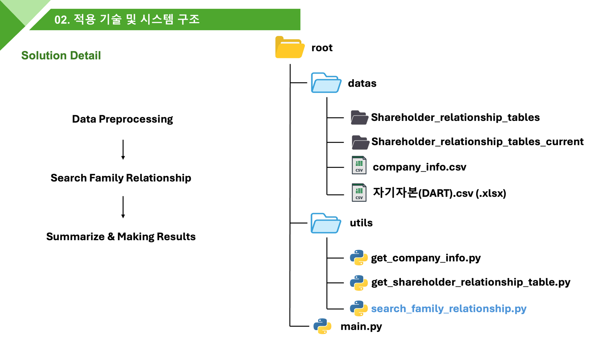

# LLM 기반 주주 구조 및 친족 지분 분석 시스템

DART 공시 데이터, 기업 정보 조사, 웹 검색 기반 RAG, LLM 추론을 활용하여 기업의 주주 구조와 친족 관계를 분석하고 친족 지분을 계산하는 시스템입니다.

---

## Functions

1. 기존 `자기자본(DART).xlsx` 파일로부터 기본 정보 Load
2. 회사 정보 조사
3. 주주 관계 조사
4. 친족 지분 계산

---

## Project File Structure

<p align="center">
  
</p>

프로젝트의 주요 디렉터리와 파일은 다음과 같이 구성됩니다.

```text
root/
├── datas/
│   ├── shareholder_relationship_tables/
│   ├── shareholder_relationship_tables_current/
│   ├── company_info.csv
│   └── 자기자본(DART).csv 또는 자기자본(DART).xlsx
│
├── utils/
│   ├── get_company_info.py
│   ├── get_shareholder_relationship_table.py
│   └── search_family_relationship.py
│
└── main.py
```

---

## Codes

## `datas/shareholder_relationship_tables.py`

### 주요 기능

1. DART의 정보를 바탕으로 과거 및 현재 시점의 주주 관계 테이블을 불러옵니다.
2. `shareholder_relationship_tables.py`만 실행할 경우, 실행 시점의 주주 관계 테이블을 코드 내부에 설정된 `OUTPUT_DIR_PATH` 아래에 저장합니다.

### 예시 동작

2025년 12월 22일경 `get_shareholder_relationship_tables.py`를 처음 실행한다고 가정합니다.

```python
"""
python get_shareholder_relationship_table.py

해당 코드를 실행한 시점의 주주 관계 사항 테이블 Load

+ 자기자본(DART) 파일을 비롯하여 과거의 가족 주주 주식 수를 알 수 있다면,
  해당 수치를 활용하여 이전에 조사한 가족 관계 정보를 활용할 수 있다.
"""

OUTPUT_DIR_PATH = "../datas/shareholder_relationship_tables"
```

`main_get_shareholder_realationship_tables()` 함수를 실행하면, 해당 코드를 실행한 시점의 주주 관계 테이블이 다음 경로 아래에 자동으로 저장됩니다.

```text
datas/shareholder_relationship_tables/
```

2026년 1월 5일경 `main.py`를 실행한다고 가정하면, `utils/get_shareholder_relationship_tables`를 호출합니다.

이때 코드 내부의 현재 DART 테이블 수집 함수인 `extract_and_save_only_target_table_current()`가 실행되며, 별도로 설정된 다음 경로에 현재 시점의 주주 관계 테이블이 저장됩니다.

```python
OUTPUT_DIR_PATH_CURRENT = "../datas/shareholder_relationship_tables_current"
```

따라서 `main.py`를 실행한 시점의 주주 관계 항목은 다음 경로 아래에 자동으로 저장됩니다.

```text
datas/shareholder_relationship_tables_current/
```

---

## `utils/get_company_info.py`

### 주요 기능

가족 주주 조사 파이프라인은 기업의 기초 정보를 활용하여 주주 간 관계를 조사합니다.

기업의 기초 정보 조사는 `get_company_info.py`를 기반으로 수행합니다.

<p align="center">
  
</p>

코드는 다음 흐름에 따라 동작합니다.

1. 환경 변수와 입력 CSV를 불러옵니다.
2. 입력 CSV의 각 기업을 순회합니다.
3. 기업명, 기업 코드, 홈페이지 등의 기본 정보를 추출합니다.
4. DuckDuckGo 검색 결과와 기업 홈페이지 요약 정보를 수집합니다.
5. 수집한 정보를 기반으로 LLM 프롬프트를 구성합니다.
6. Ollama 기반 LLM에 질의합니다.
7. LLM 응답을 파싱하고 검증합니다.
8. 처리 결과를 `company_info.csv` 파일로 저장합니다.

동작 수행 결과는 전체 기업의 정보를 하나의 `company_info.csv` 파일로 저장합니다.

---

## `utils/search_family_relationship.py`

### 주요 기능

`datas/shareholder_relationship_tables`에 저장된 주주 명부 중, `친족여부` 컬럼이 `친족`으로 표기된 데이터만 추출합니다.

이후 해당 인물이 친족 중에서 정확히 어떤 관계를 맺고 있는지 조사합니다.

<p align="center">
  
</p>
### 1. 코드의 핵심 목적

- **입력(Input)**  
  `datas/shareholder_relationship_tables` 폴더에 있는 주주 명부 중,  
  `친족여부` 컬럼이 `친족`으로 표기된 데이터만 추출합니다.

- **처리(Process)**
  1. **기준점 확보:** 회장 또는 대표자의 이름을 찾습니다.
  2. **정보 수집(RAG):** `회사명 + 주주 이름`으로 검색하여 뉴스 및 프로필 정보를 수집합니다.
  3. **LLM 추론:** 해당 인물이 이미 가족 관계로 분류되었다는 전제 아래, 아들·딸·배우자 등 구체적인 세부 관계를 추론합니다.

- **출력(Output)**  
  `datas/family_detail_results/` 폴더에 다음 항목이 포함된 CSV 파일을 저장합니다.

```text
이름, 기준 인물, 세부 관계, 근거
```

### 2. 주요 기능 및 로직

1. 모든 주주를 대상으로 분석하지 않고, 먼저 `친족`으로 라벨링된 사람만 분석 대상으로 선정합니다.
2. 가족 관계를 정의하기 위해 기준 인물을 설정합니다.
3. 기준 인물은 `company_info.csv`를 불러온 뒤 다음 우선순위에 따라 결정합니다.

```text
회장 > 대표이사 > 대표자
```

4. 기준 인물과 친족 주주 사이의 구체적인 관계를 웹 검색과 LLM을 활용하여 분석합니다.
5. 분석 결과와 근거를 구조화된 CSV 형태로 저장합니다.

---

## `main.py`

### 주요 기능

친족 주주 관계 조사 전체 파이프라인을 실행합니다.

<p align="center">
  
</p>
### 세부 설명

1. 기존에 조사한 `shareholder_relationship_tables`와 코드를 실행할 때 생성된 `shareholder_relationship_tables_current`를 비교합니다.
2. 새로 등장한 인물의 유무, 보유 주식 수 변화, 관계 변화 등을 분석하여 차이가 있는 인물을 추출합니다.
3. 차이가 발생한 인물에 대해서만 가족 관계 조사를 진행할 수 있습니다.
4. 옵션을 통해 모든 기업과 전체 대상자를 다시 조사할 수도 있습니다.
5. 가족 관계 조사가 끝나면, 분석된 정보를 바탕으로 가족 관계가 예상되는 인물들의 가족 관계도를 작성합니다.
6. 아버지가 2명 또는 어머니가 2명으로 추론되는 것과 같은 제약조건 위반이 발생하면 재검증 과정을 수행합니다.

---

## 결과

### 1. 정밀 관계 분석 리포트(Structured Data)

가장 기본이 되는 결과물로, LLM과 웹 검색 기반 RAG가 협업하여 생성한 구조화된 CSV 데이터입니다.

- **인물·법인 식별(Entity Classification)**  
  주주 명부에 포함된 이름이 실제 인물인지, 재단·계열사 등의 법인인지 구분합니다.

- **구체적 친족 관계 규명**  
  기존 데이터의 모호한 `친족` 표기를 넘어 배우자, 자녀, 부모, 형제자매 등 구체적인 가족 관계를 명시합니다.

- **추론 근거 제공(Explainability)**  
  관계를 판단한 이유와 LLM 추론 근거, 참고한 웹 검색 요약 정보를 함께 제공합니다.

- **논리적 보정**  
  아버지 또는 어머니가 복수로 지정되는 것과 같은 논리적 오류를 재검증하여 보정합니다.

> 결과물 예시

<p align="center">
  
</p>

### 2. 한국형 지배구조 가계도(Hierarchical Visualization)

분석된 데이터를 바탕으로 보고서에 활용할 수 있는 직관적인 가족 관계도 이미지를 생성합니다.

<p align="center">
  
</p>
- **세대별 계층 구조(Generation Layering)**
  - **상단:** 부모 세대 또는 창업주·선대 회장
  - **중단:** 현재 경영 주체인 회장·대표자 및 배우자
  - **하단:** 자녀 세대, 후계자 및 승계 대상

- **직각 배선 스타일(Orthogonal Layout)**  
  한국 기업 분석 보고서에서 자주 사용하는 `ㄱ`자 및 `ㅗ`자 형태의 직각 연결선을 활용합니다.

- **정보 시각화**  
  각 인물의 이름뿐만 아니라 관계(Role)와 보유 주식 수를 박스 안에 함께 표시하여 지배력을 쉽게 파악할 수 있도록 구성합니다.

> 결과물 예시

```text
datas/family_graph/삼성전자_family_graph.png
```

---

## Paper

프로젝트와 관련된 논문 및 참고 문서는 다음과 같습니다.

- `LLM 기반 주주 구조 분석 시스템 논문 초안 (KCI급).pdf.pdf`

---

## 전체 파이프라인 요약

```text
DART 자기자본 데이터 Load
        ↓
과거 주주 관계 테이블 수집
        ↓
기업 기본 정보 조사
        ↓
현재 주주 관계 테이블 수집
        ↓
과거·현재 주주 데이터 비교
        ↓
변경 인물 및 친족 후보 추출
        ↓
웹 검색 기반 RAG
        ↓
LLM 세부 관계 추론
        ↓
논리 제약조건 검증 및 재검증
        ↓
정밀 관계 분석 CSV 생성
        ↓
친족 지분 계산 및 가족 관계도 생성
```

---

## Notes

- LLM이 생성한 친족 관계는 자동 추론 결과이므로, 공식 사실로 확정하기 전에 DART 공시, 기업 공식 홈페이지 및 신뢰할 수 있는 언론 자료를 통해 추가 검증해야 합니다.
- 웹 검색 결과와 LLM 응답 품질에 따라 관계 추론 결과가 달라질 수 있습니다.
- 실제 운영 시에는 각 관계에 대한 출처 URL, 검색 일자, 검증 상태를 함께 관리하는 것을 권장합니다.
